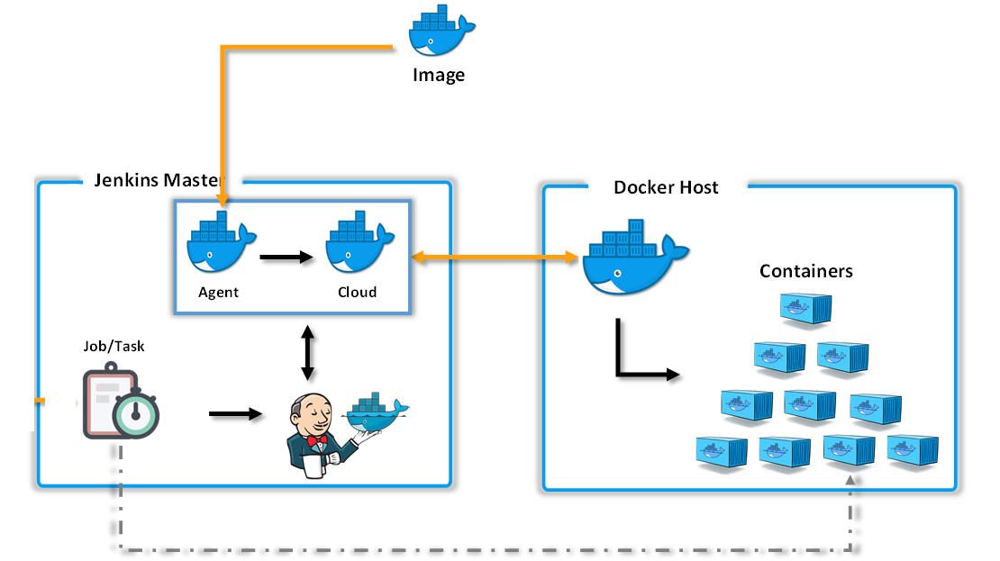
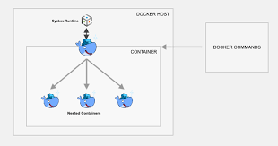
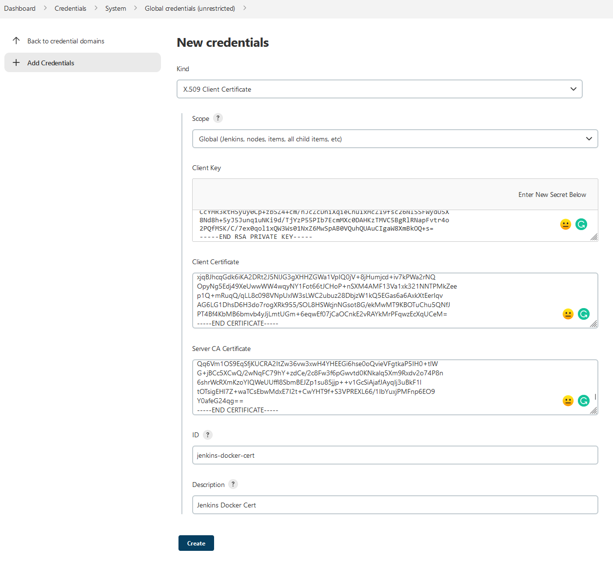
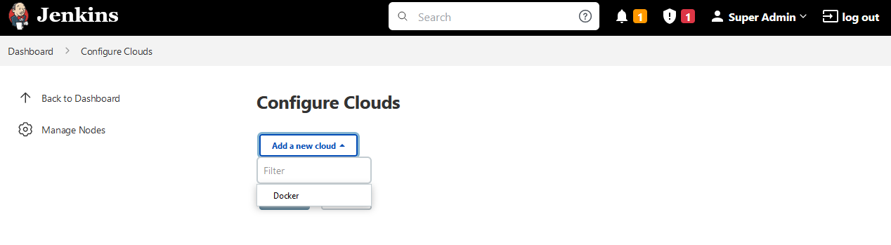
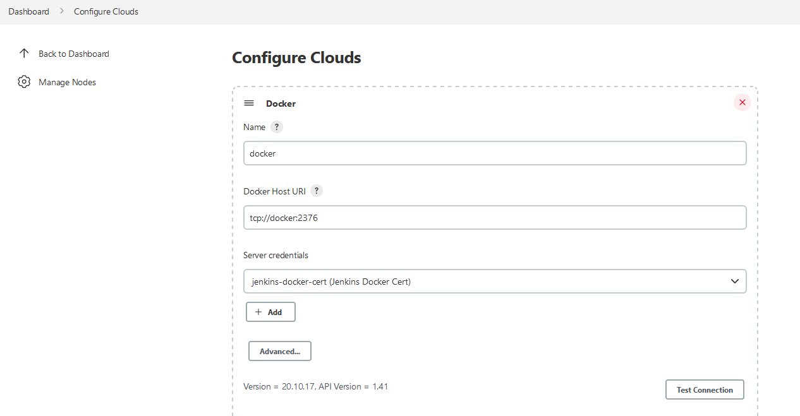
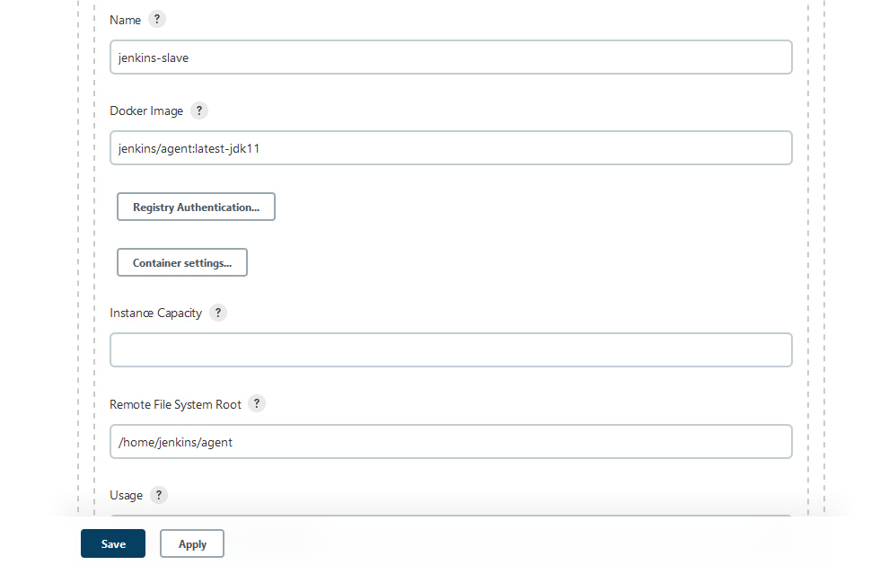

# Jenkins Architecture - Task 2



## Task #2

Trong task này:
- Bạn sẽ được giới thiệu về `Docker in Docker` (aka `Dind`).
- Bạn sẽ tạo Jenkins Slave ở dạng dynamic slave:
  - Cài đặt Docker in Docker bằng image `docker:dind`
  - Tạo dynamic slave kết nối với Docker in Docker được tạo ở trên
  - Tạo docker agent template sẵn sàng cho Job Build sử dụng

## 1. Giới thiệu về Docker in Docker

### 1.1. Giới thiệu

- Là cách chạy Docker Host trong một Docker container
- Có 2 cách cài đặt:
  - Sử dụng image `docker:stable-dind`
    - Docker daemon trên máy chủ riêng biệt với Docker daemon trong dind
    - Sử dụng flag privileged, container dind không có giới hạn, có thể làm hầu hết mọi việc mà host có thể làm
    - Không thể sử dụng docker-compose trong dind
  - Sử dụng `/var/run/docker.sock` từ Docker host
    - Dễ hiểu khi mount socker từ Host vào dind container
    - Cả 2 docker host đều thấy được container của nhau.


### 1.2. Lợi ích của Dind

- Chạy hệ thống CI như GitLab, Jenkins trong Docker container
- Thử nghiệm Docker trong chính Docker

## 2. Tạo dynamic slave trong Jenkins

Bạn sẽ sử dụng Docker in Docker làm Dynamic Slave cho Jenkins.

## 2.1. Tạo Docker in Docker container

Trên máy chủ chạy jenkins server, thực hiện tạo docker network và cài đặt Docker in Docker bằng image `docker:dind`

```bash
# Create new network
docker network create jenkins

# Add jenkins-server container to jenkins network
docker network connect jenkins jenkins-server

# Run container Docker in Docker
docker run \
  --name jenkins-docker \
  -itd \
  --privileged \
  --env DOCKER_TLS_VERIFY=1 \
  --env DOCKER_TLS_CERTDIR="/certs" \
  --volume jenkins-docker-certs:/certs/client \
  --volume jenkins-data:/var/jenkins_home \
  --network jenkins --network-alias docker \
  -p 2376:2376 \
  docker:dind
```

Câu lệnh trên chúng ta thêm TLS cho Docker in Docker, nhằm nâng cao tính bảo mật. Trong network jenkins, container chạy dind có domain name là docker thông qua option `network-alias`. Kiểm tra trạng thái của dind:

```bash
docker ps -f "name=jenkins-docker"
```

Kiểm tra network `jenkins` có 2 container `jenkins-server` và `jenkins-docker`:

```bash
docker network inspect jenkins
```
  
### 2.2. Cài đặt plugin docker

Để có thể sử dụng Docker như một dynamic slave, bạn cần cài đặt plugin **Docker**.

Để cài đặt plugin này, vào mục **Manage Jenkins** => **Manage Plugin** => Chọn tab **Available** => Tìm kiếm và chọn plugin **Docker** => Ấn nút **Install without restart**.

### 2.3. Tạo Jenkins Credential lưu trữ certificate tới jenkins-docker

- Để cài đặt plugin này, vào mục **Manage Jenkins** => **Manage Credential** => Chọn **global** => **Add Credentials** => Chọn loại **X.509 Client Certificate** trong Kind.

- Các giá trị của các trường trong credential thu được từ các lệnh.

| Trường                | Kết quả của lệnh chạy trên host                       |
|-----------------------|-------------------------------------------------------|
| Client Key            | docker exec jenkins-docker cat /certs/client/key.pem  |
| Client Certificate    | docker exec jenkins-docker cat /certs/client/cert.pem |
| Server CA Certificate | docker exec jenkins-docker cat /certs/server/ca.pem   |
| ID                    | jenkins-docker-cert                                   |
| Description           | Jenkins Docker Cert                                   |

- Ấn Create để tạo Credential



### 2.3. Cấu hình trên Jenkins Server


- Vào mục **Manage Jenkins** => **Manage Nodes and Clouds** => **Configure Clouds** => Ấn **Add a new cloud** và chọn **Docker**



- Ấn Docker Cloud deatails... để mở phần cấu hình của Docker Cloud. Thực hiện điền các thông tin sau vào form:

| Trường | Giá trị |  
|--|--|  
| Name | docker |  
| Docker Host URI | tcp://docker:2376 |  
| Server credentials | jenkins-docker-cert |  

- Ấn **Test Connection** để kiểm tra kết nối tới Docker Cloud



- Chọn **Enabled**, cho phép Jenkins sử dụng Docker Cloud có tên là **docker**
- Ấn **Apply** để lưu lại cấu hình này.

### 2.4. Cấu hình Docker Agent Templates

Docker Agent Template là container sẽ được khởi tạo để xử lý Build Job. Bạn sẽ tạo ra một Template Agent.

Vẫn trong màn hình cấu hình Docker Cloud, click **Docker Agent Template** => Click **Add Docker Template** => Điền các giá trị tương ứng(Các trường dữ liệu khác để mặc định):

| Trường | Giá trị |  
|--|--|  
| Labels | jenkins-agent |  
| Enabled | bật |  
| Name | jenkins-slave |  
| Docker Image | jenkins/agent:latest-jdk11 |
| Remote File System Root | /home/jenkins/agent |

**Labels** và **Name** sử dụng để Jenkins Master điều phối tới agent cụ thể.



Ấn **Save** để lưu lại và áp dụng cấu hình của Docker Cloud.

