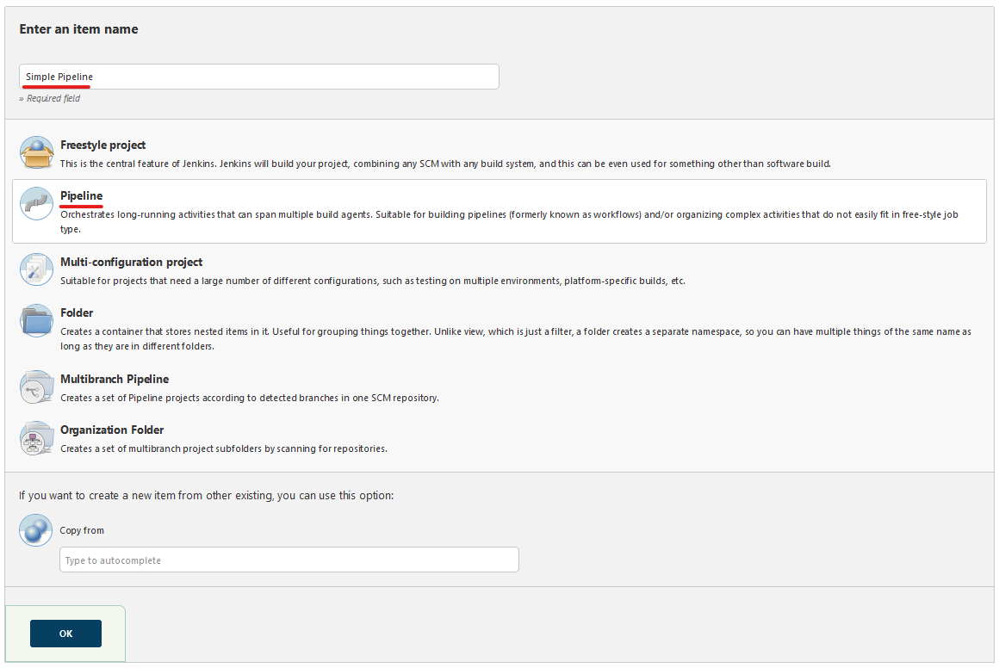

# Task #1

Trong task này, bạn được yêu tạo 1 Simple Pipeline. Jenkinsfile sẽ được nhập trực tiếp trong giao diện của Job Build Pipeline.
    
## 1. Tạo Jenkins Pipeline  
### 1.1.  Tạo pipeline
- Chọn **New Item** 

- Nhập tên của Job Build, chọn **Pipeline** => Click **OK**

- Mục **Pipeline** => Nhập nội dung cho `Jenkinsfile`

- Click **SAVE** để lưu cấu hình của Job Build.

### 1.2.  Run pipeline

- Trong màn hình của Job Build, click **Build Now**

- Kiểm tran kết quả của Job và console log của Job build, kiểm tra xem Jenkinsfile có được thực thi đúng hay không

### Task #1 Completed

## 2. Yêu cầu kết quả

Chụp lại màn hình kết quả và console output