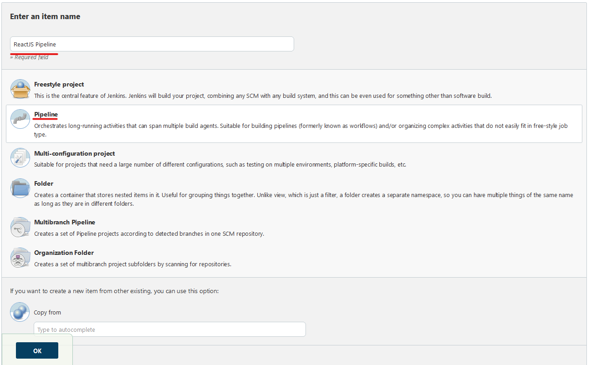
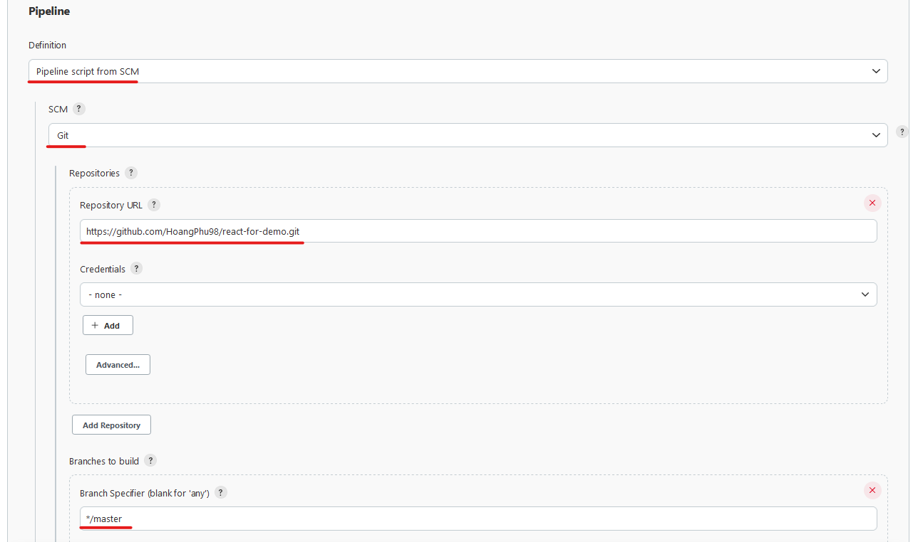
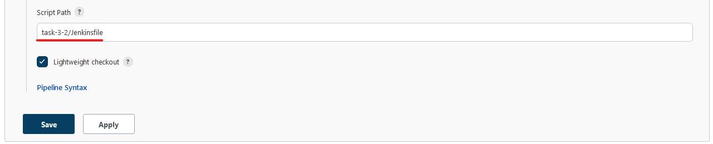
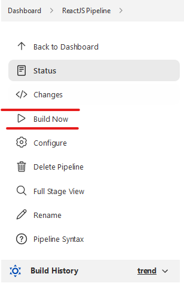
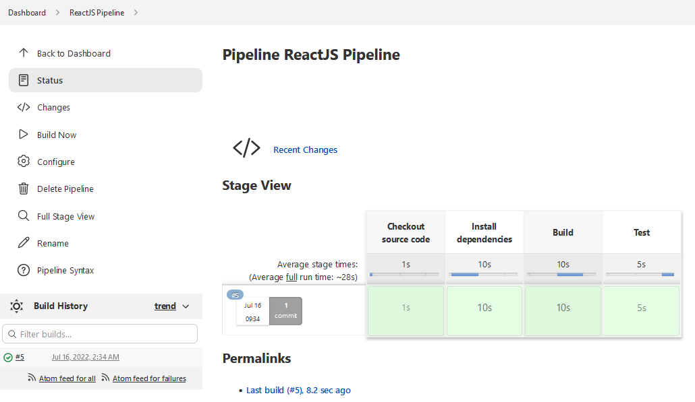
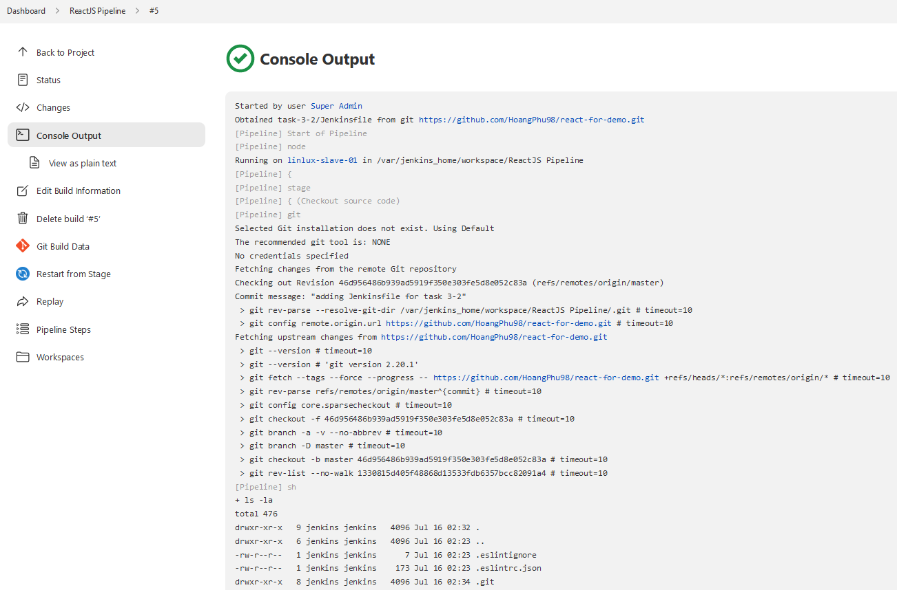

# Task #2

Trong task này, bạn được yêu cầu tạo mới một Jenkins Pipeline có sử dụng source từ Git để build và test mã nguồn ReactJS. Repo source code sử dụng: https://github.com/HoangPhu98/react-for-demo

Kiến thức cần nắm sau khi thực hiện task này:
- Cấu hình Jenkins Pipeline với Github Repository ở chế độ Public
- Viết Jenkinsfile và thực hiện một số tác vụ trong `steps` của Pipeline
    
## 1. Tạo Jenkins Pipeline  

### 1.1.  Tạo pipeline
- Bắt đầu tạo job build, chúng ta chọn **New Item**

- Nhập tên của Job Build `ReactJS Pipeline` chọn **Pipeline** => Click **OK**

- Mục **Pipeline** => Chọn **Pipeline script from SCM** => Chọn **Git**

- Phần **Repository URL** chọn tới Repository chứa Jenkinsfile. 

> Thường Jenkinsfile sẽ được đặt cùng với source code trên repository
> Repo public sử dụng cho bài thực hành số 2: [React For Demo](https://github.com/HoangPhu98/react-for-demo). Bạn hãy fork repo này về để sử dụng.
 

- Phần **Script Path** để đường dẫn tương đối tới **Jenkinsfile**:

- Click **SAVE** để lưu lại cấu hình của Jenkins Pipeline.

### 1.2.  Run pipeline

- Click **Build Now**

- Xem kết quả của job tại màn hình chính của Job Build và thực thiện xem console log Job build để kiểm tra xem Jenkinsfile có được thực thi đúng hay không

### Task #1 Completed

## 2. Yêu cầu kết quả

Chụp lại màn hình kết quả chạy Job Build và console output.