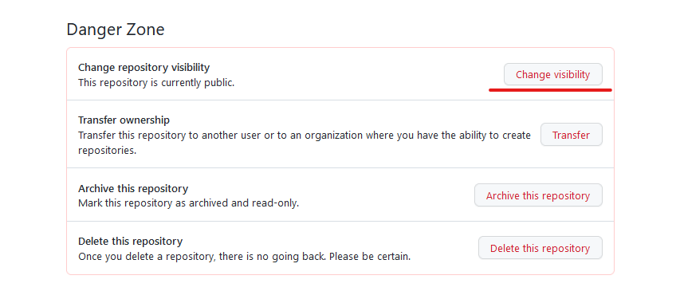
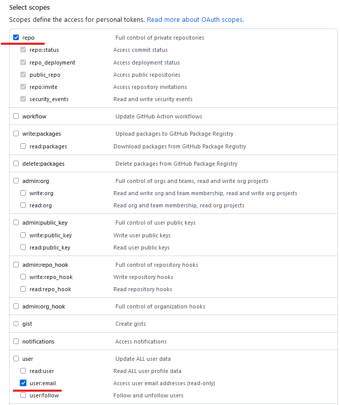
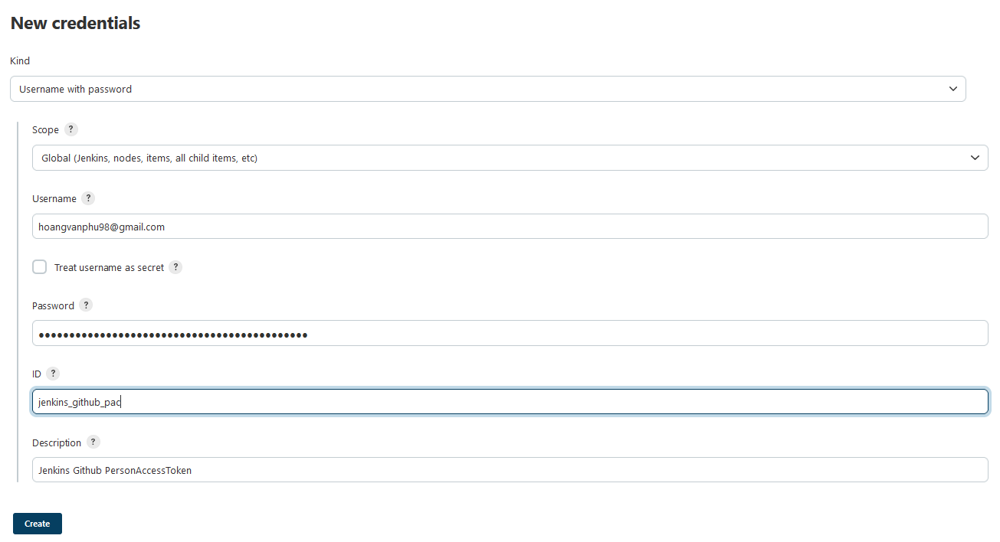
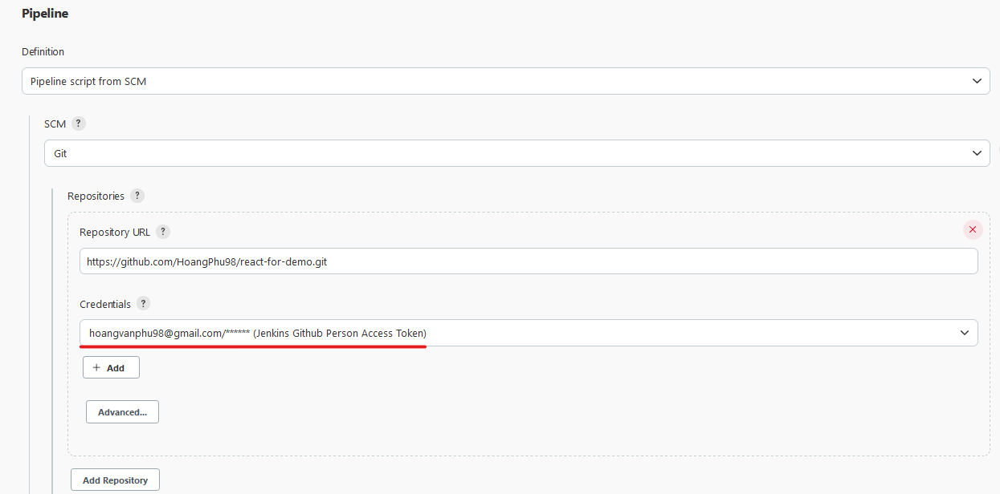
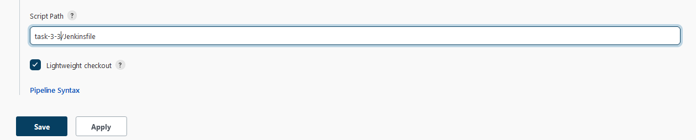
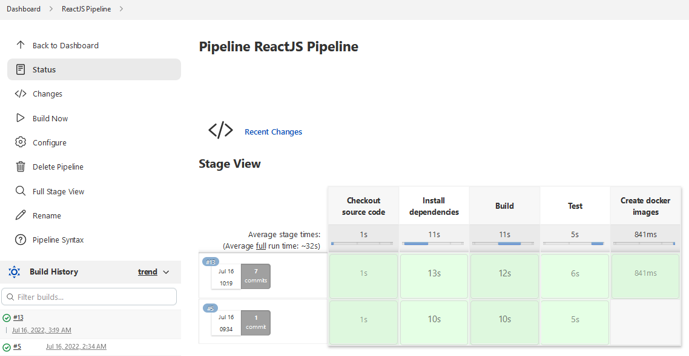
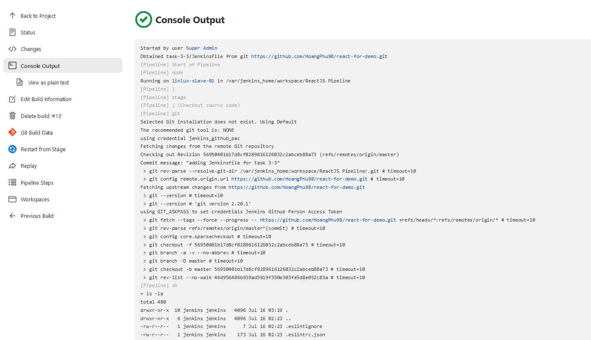

# Task #3  

Trong task này, bạn được yêu cầu tiếp tục cập nhật Job Build **ReactJS Pipeline** từ `task 2`. Bạn sẽ đưa repo của mình về private, và cập nhật Job Build và Jenkinsfile để kết nối được tới private repo này. Thêm nữa, bạn sẽ sử dụng docker `docker` và `docker pipeline` để thực hiện build docker image từ ứng dụng.

Trong task này bạn sẽ nắm vững:
- Cấu hình Jenkins Pipeline và Jenkinsfile sử dụng Private Repository
- Tạo Personal Access Token trên Github
- Cài đặt và sử dụng Docker trong stage của Jenkins Pipeline
- Cách truyền dữ liệu giữa các stage trong Jenkins Pipeline
      
## 1. Thiết lập Repository và Github

### 1.1. Chuyển mode của repository

- Mở Github truy cập vào repo của bạn -> Click **settings** -> đưa màn hình xuống phần **Danger Zone** -> Click **Change visibility** -> Chọn **Make private** -> Nhập tên repo -> Click **I understand, change repository visibility**

  

### 1.2. Tạo Access Token cho tài khoản GitHub

- Vào phần **Settings** của tài khoản -> Click Developer settings -> Click **Person access tokens** -> Click **Generate new token**

- Nhập tên của Person access token -> Chọn quyền của token: `repo` và `user:email`

  

- Token xuất hiện, lưu ý, token chỉ xuất hiện một lần và token này là bí mật, cần bảo quản cẩn thận.

## 2. Cài đặt plugin Docker và Docker Pipeline

Để sử dụng Docker trong Jenkisn Pipeline, chúng ta cần cài đặt thêm 2 plugin: `Docker` và `Docker Pipeline`.

> Lưu ý: Jenkins Slave cần cài đặt docker trước. Trong task của buổi số 2, Jenkins slave trên docker của bạn đã được cài đặt docker và sẵn sàng cho sử dụng.

- Click **Manage Jenkins** -> click **Available** -> tìm kiếm Docker -> Chọn `Docker plugin` và `Docker Pipeline` -> Click **Install without restart**

## 3. Cấu hình Job Build và Chỉnh sửa Jenkinsfile

### 3.1. Tạo Github credential

Trong bước này, bạn sẽ tạo github credential để Job Build có thể truy cập vào private repository.

- Click **Manage Jenkins** -> Click **Manage Credentials** -> Click **global** -> Click **Add Credential*
- Chọn **Username with password**
- Trong phần form, nhập email của tài khoản github vào `username`
- Nhập token vừa tạo được ở phần `#1` vào `password` 
- Nhập ID **jenkins_github_pac** và Description cho credential



Credential của bạn đã sẵn sàng kết nối tới Github repository của bạn.

### 3.2. Cấu hình Job Build

Trong bước này, bạn sẽ cập nhật cấu hình của Job Build trên UI: thêm credential cho repository chưa jenkinsfile.

Sửa cấu hình Pipeline:

- Chọn Job Build **ReactJS Pipeline** -> click **Configure** -> Add credential `jenkins_github_pac` trong Git.



- Kiểm tra **script path** dẫn tới Jenkinsfile



### 3.3. Cập nhật Jenkinsfile

- Cập nhật nội dung Jenkinsfile để pipeline có thể truy cập tới private repo và thêm stage build docker image.

- Thêm stage thực hiện build docker image từ source code của bạn.

Tham khảo Jenkinsfile trong **task 3** này.

### 3.3.  Run pipeline  
- Click **Build Now**  



- Check trong Log của Job build và kiểm tra xem Jenkinsfile có được thực thi đúng hay không



### Task #3 Completed

## 4. Yêu cầu kết quả

Chụp lại màn hình kết quả chạy Job Build và console output.

## 5.Troubleshooting

### Got permission denied while trying to connect to the Docker daemon socket at unix:///var/run/docker.sock

Cách xử lý:
- Truy cập vào Container Jenkins Slave:
```/bin/bash
docker exec -it <container_slave_id> bash
```
- Trong Jenkins Slave, kiểm tra Group ID/Group Name của docker socket
```
root@0007222585af:/# stat /var/run/docker.sock
  File: /var/run/docker.sock
  Size: 0               Blocks: 0          IO Block: 4096   socket
Device: 19h/25d Inode: 1016        Links: 1
Access: (0666/srw-rw-rw-)  Uid: (    0/    root)   Gid: (  998/ UNKNOWN)
Access: 2022-09-04 07:26:17.420050925 +0000
Modify: 2022-09-04 06:25:25.022148967 +0000
Change: 2022-09-04 07:15:10.586492205 +0000
 Birth: -
```
- Group của docker.sock ở trạng thái UNKOWN, chúng ta cần sửa lại group này trong Jenkins Slave, bằng cách thêm group `docker2` tương ứng với Group ID ở trên(998)
```
jenkins@0007222585af:~$ groupadd -g 998 docker2
jenkins@0007222585af:~$ stat /var/run/docker.sock
  File: /var/run/docker.sock
  Size: 0               Blocks: 0          IO Block: 4096   socket
Device: 19h/25d Inode: 1016        Links: 1
Access: (0660/srw-rw----)  Uid: (    0/    root)   Gid: (  998/ docker2)
Access: 2022-09-04 07:42:41.003950502 +0000
Modify: 2022-09-04 06:25:25.022148967 +0000
Change: 2022-09-04 07:28:47.115352680 +0000
 Birth: -
```
- Thêm group `docker2` cho user `jenkins` và kiểm tra các groups mà user `jenkins` có
```/bin/bash
root@0007222585af:/# usermod -aG docker2 jenkins
root@0007222585af:/# groups jenkins
jenkins : jenkins docker docker2
```
- Trên Jenkins UI, vào phần quản lý node, thực hiện disconnect node và kết nối lại để load lại cấu hình cho Jenkins Slave.
