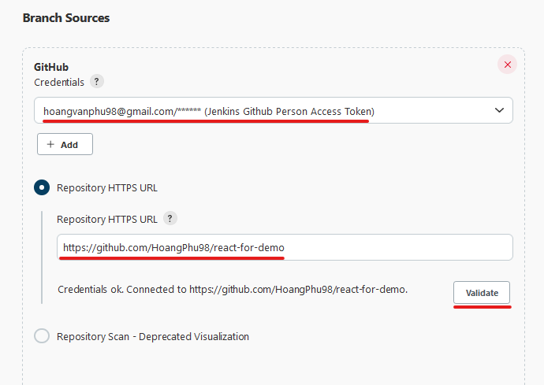

# Task #1  

Trong task này, bạn được yêu cầu tạo một Job Build với Multibranch Pipeline. Đồng thời cũng thiết lập **Webhook** trên Github để trigger các hành động từ GitHub sang Jenkins.

Yêu cầu:
- Fork repo: https://github.com/HoangPhu98/react-for-demo về Github cá nhân, và chuyển repo về trạng thái private
- Kiểm tra các nhánh: master, develop, release

## 1. Cấu hình Webhook

#### 1.1. Cấu hình GitHub Server  

- Truy cập vào Repo github của bạn -> Click **Settings** -> Click **Webhooks*
- Điền **PayloadURL**: `http://<jenkins_server>/github-webhook/`
- Chọn **Content type**: `application/json`
- Click **Add webhook**


> Lưu ý: nếu bạn cài đặt Jenkins server trên máy ảo, xem lại hướng dẫn bài `1_jenkins-installation` để lấy địa chỉ public của Jenkins server
  
## 2. Tạo Jenkins multibranch pipeline 

### 2.1. Tạo Multibranch Pipeline

- Trên Jenkins server chọn **New Item** -> Nhập tên cho Job Build -> Chọn **Multibranch Pipeline** -> Click **OK**  
  
  
  
- Mục **Branch Sources** => chọn **Add source** => chọn **Github**  
- GitHub yêu cầu chọn hoặc tạo mới **Credentials**, bạn sẽ sử dụng credential đã tạo ở bài trước
- Nhập github url https cho **Repository HTTPS
- Click **Validate** để kiểm tra kết nối tới repository.
  
  
  
- Trong phần Behaviors, chúng  ta sẽ thiết lập một số cấu hình liên quan tới hành vi của Multibranch Pipeline khi nhận sự kiện từ GitHub. Bạn sẽ thêm hành vi để lọc những nhánh cần thiết cho Job Build.
- Click **Add** -> Chọn **Filter by name (with regular expression)** -> Nhập `(develop|release.*|feature.*|bugfix.*)`

- Các mục khác để mặc định và Click **Save**  
- Kiểm tra xem các Branch đã được Jenkins Scan thành công hay chưa  
  
  
 
> Lưu ý: Trong trường hợp chưa có Jenkinsfile ở nhánh nào thì việc Scan sẽ không hiển được pipeline với nhánh đó.

### 2.2. Tạo Commit để Trigger Webhook

Tạo nhánh `feature-01`, sửa file code và commit

```
# Checkout nhánh develop
$ git checkout develop

# Tạo nhánh mới từ develop 
$ git checkout -b feature-01

# Sửa file README.md tùy ý sau đó commit và push lên nhánh feature-01
$ git add .
$ git commit -am "Modify README.md"
$ git push orgin feature-01
```

Nhánh `feature-01` sẽ được tạo Jenkins Pipeline tự động, và một job của Pipeline này sẽ được thực hiện:

 

 

Tạo **Pull Request** trên GitHub để merge nhánh **feature-01** vào nhánh **develop**

 


- Jenkins pipeline được Trigger và chạy trên nhánh **develop**


## 3. Kết quả

Chụp lại kết quả:
- Danh sách các branch trong Multibranch quét được
- Job trên branch `feature-01`
- Job trên branch `develop`