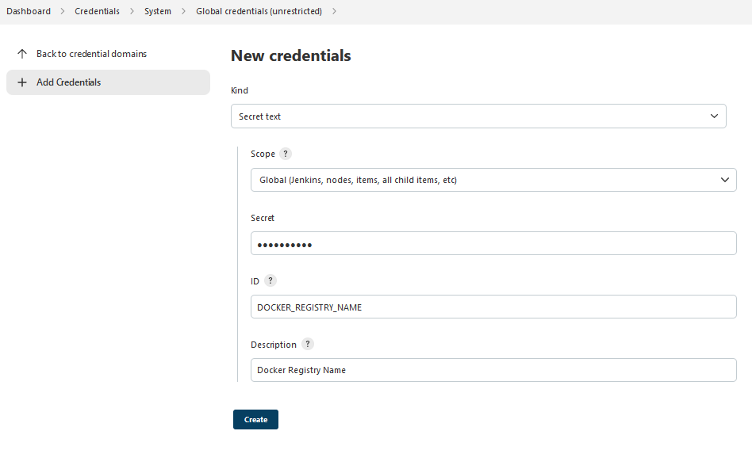
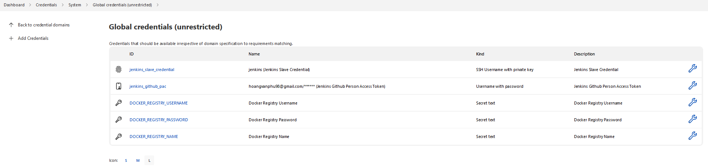
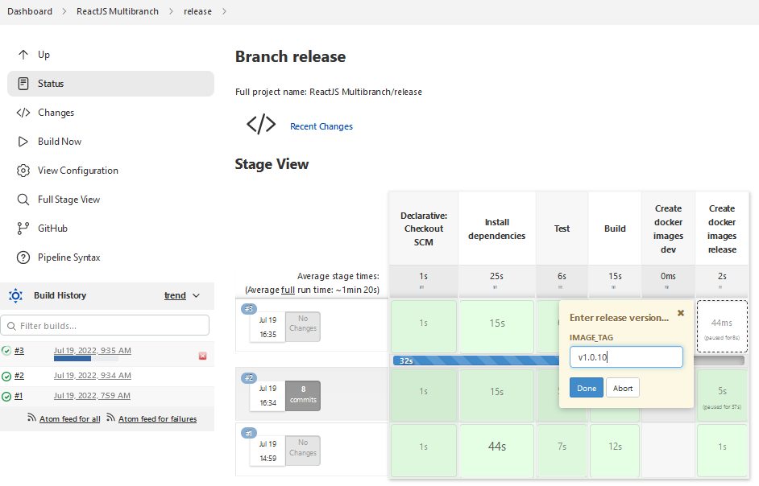
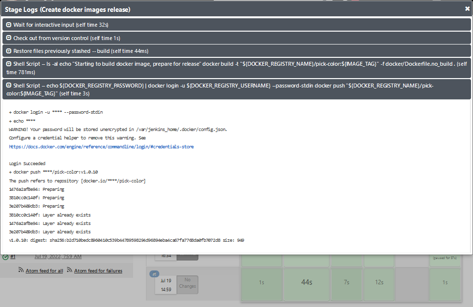
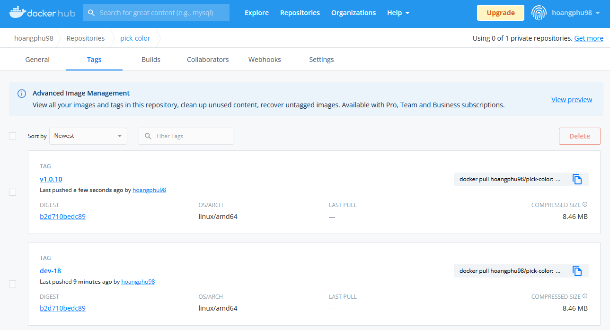

  
# Task #2  

Trong task này, bạn được yêu cầu chỉnh sửa Jenkinsfile ở **task #1** cho stage tạo image trên 2 nhánh `develop` và `release`:
- Sử dụng Docker để Build Image và sau đó push lên Docker Hub Registry
- Sử dụng biến môi trường & credential trong Pipeline
- Trên nhánh `release` cho phép nhập vào version trước khi tạo image

## 1. Tạo Docker credential

Docker credential cấu tạo từ 3 thành phần: username, password, và registry. Chúng ta sẽ tạo 3 credential có kind là text để lưu trữ giá trị cho 3 thành phần này.
- Vào mục **Manage Jenkins** => **Manage Credentials** =>  Chọn domain **global** và chọn **Add Credentials**  
- Ở phần **Kind** chọn **Secret text**.
- Nhập **ID** là giá trị trong bảng dưới đây
- Nhập **Secret** là giá trị của thành phần tương ứng.

| ID | Mô tả  |
|--|--|
| DOCKER_REGISTRY_USERNAME | Username để xác thực với Docker Registry |
| DOCKER_REGISTRY_PASSWORD| Password để xác thực với Docker Registry |
| DOCKER_REGISTRY_NAME| Tên của Registry, ví dụ: docker.io/\<username> |

## 2. Cập nhật Jenkinsfile

Tham khảo Jenkinsfile. Lưu ý tại phần sử dụng Credential và Input.

Kết quả trên nhánh `develop` sau khi push commit chứa update cho Jenkinsfile.

Thực hiện tạo PR từ `develop` tới `release` và merge Pull Request này.

Tới bước `Create docker images release`, bạn sẽ được yêu cầu nhập vào image tag cho bản release này.

Kiểm tra image được thêm mới trên Docker Hub.

## 3. Kết quả

Chụp lại kết quả cho job của nhánh `develop` và `release` và image được đẩy lên DockerHub.
