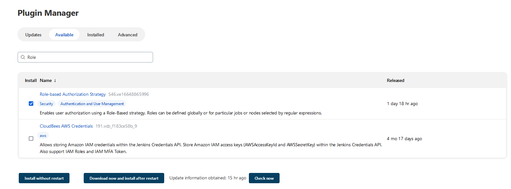

# Jenkins Security - Task 1

Trong task này mục tiêu bạn:
- Cài đặt và sử dụng Role-Based Authorization Strategy
- Tạo được users và gán quyền cho user này.

## Kiến thức

Plugin **Role-based Authorization Strategy** cho phép quản **Role** và phân quyền cho **Users**

Một số concepts:
  
- **Global roles** cho phép quản lý tác vụ chung, Agent, Job, Run và SCM permission ở mức Global
- **Project roles/Item roles** cho phép thiết lập permision cho các Job, Run theo một project cụ thể.
- **Agent role** cho phép thiết lập permission liên quan tới Node, Agent
- Gán roles cho users và groups

### Prequisites

1. Cài đặt Jenkins
2. Tạo Job bất kỳ và được đặt tên là **Simple Pipeline**
----------------------------  

## Installation and Authorization  
  
Trong bước này, bạn sẽ cài đặt plugin Role-Based Authorization Strategy. Và cấu hình phân quyền trong Jenkins bằng Role Based Strategy.
  
Truy cập **Manage Jenkins** > **Manage Plugins** > **Available**  và search "Role-based Authorization Strategy", chọn plugin này và click **Install without restart** để tiến hành cài đặt.

  
 
Sau khi cài đặt thành công Plugin cần bật chế độ phân quyền sử dụng Pluging này.
Go to **Manage Jenkins** > **Configure Global Security**, kéo xuống phần  **Authorization**  chọn **Role-Based Strategy option**,  như hình dưới đây.  
  
  

Click nút **Save** để lưu lại và áp dụng cấu hình Authorization mới này.
  
### User Creation  

Bạn sẽ tạo user `dev_user` trong Jenkins và thử truy cập Jenkins bằng tài khoản mới này.

Truy cập **Manage Jenkins** > **Manage Users** > **Create Users**, điền thông tin cho biểu mẫu để tạo user `dev_user`.
  
  
  
Truy cập trang Jenkins UI (**IP:8080**) trong ẩn danh, cung cấp thông tin đăng nhập cho `dev_user`. Màn hình dưới đây xác nhận user này không có quyền truy cập vào bất cứ resources này của Jenkins
  
  
  
## Manage and Assign Roles  

Trong phần này, chúng ta sẽ tạo thêm role mới và gán role này cho user `dev_user`.
  
### Add Roles

Truy cập **Manage Jenkins** -> **Manage and Assign Roles** -> **Manage Roles**  
 
> Note:\
Nếu như không nhìn thấy mục **Manage and Assign Roles**  thì cần kiểm tra xem đã cài lại Plugin hay chưa [Role-based Authorization Strategy](https://plugins.jenkins.io/role-strategy).  
  
Trong phần **Manage Roles** sẽ có 2 phần bạn cần lưu ý, một là **Global roles** và phần còn lại là **Item roles** hãy bắt đầu với **Global roles**
  
**Global roles**:

Ở **Global roles** section thêm một **role** mới đặt tên là **developer** và gán quyền **Read** trong **Overall** Section như hình dưới đây:
- Nhập **developer** trong **Role to add**
- Click **Add**
- Chọn **Read** trong **Overall**
  
  
  
**Item roles**:

Bên dưới mục Items roles, thêm một role mới và đặt pattern cho role mới này. Trong ví dụ, role được tạo ra có tên là **simple_role** và pattern **Simple.\*** nhằm chỉ định các Job, Projects khớp với pattern này và sẽ được gán quyền cho users như mô tả hình dưới đây:
  
  
  
### Assign Roles

Truy cập **Manage Jenkins** > **Manage and Assign Roles** > **Assign Roles** tại đây chúng ta sẽ phải làm việc với **Global roles** và **Item roles**
  
**Global roles**:

Điền tên của user **dev_user** -> click **Add** -> Tích chọn role  **developer**
  
  
  
**Item roles**:

Ở mục này, cung câp tên user **dev_user** -> click **Add** -> Sau đó tích chọn role **simple_role**.
  
  

### Kết quả  

Login lại vào Jenkins với user **dev_user** để kiểm tra xem Users đã được phân quyền đúng hay chưa. Nếu thành công, error lúc ban đầu sẽ biến mất, user sẽ nhìn thấy Job **Simple Pipeline**
  


Thực hiện build Job cho Simple Pipeline:


## Troubleshooting

### Login Failed

Trong quá trình config Authorization trong Jenkins mà sau đó bạn không thể truy cập vào Jenkins, nguyên nhân có thể do cấu hình Authorization bị lỗi.

**Khắc phục**: Bạn sẽ cần khắc phục bằng cách xóa bỏ cấu hình Authorization, để có thể login trở lại vào Jenkins Server.

Step 1: Dừng Jenkins(dừng container chạy Jenkins Server)

```/bin/bash
docker stop <container_id_jenkins_server>
```

Step 2: Sửa file cấu hình của Jenkins server. Ví dụ, container có mount volume Jenkins home tại đường dẫn `/var/jenkins_home`, sửa file `/var/jenkins_home/config.xml`:

```config
# Thiết lập false trong useSecurity attribute
<useSecurity>false</useSecurity>

# Xóa các attribute authorizationStrategy
<authorizationStrategy>...</authorizationStrategy>
```
