  
  
# Jenkins Integratin - Task #1

Trong task này, bạn được yêu cầu cài đặt công cụ quét code tĩnh **SonarQube** sau đó tích hợp vào **Jenkins Pipeline** để quét một project Java mẫu.

## Prequisites  
| Yêu cầu |  Version|  
|--|--|  
| docker-compose ([guideline](https://docs.docker.com/compose/install/#alternative-install-options)) | 1.21.2+ | 
| docker plugin ([guideline](https://plugins.jenkins.io/docker-workflow/)) |latest | 

## 1. Cài đặt SonarQube
### 1.1.  Cài đặt SonarQube

```console
# Di chuyen toi thu muc code
$ cd jenkins-course/6_jenkins-integration

# Tăng Virtual Memory sử dụng cho ElasticSearch trong SonarQube 
$ echo "vm.max_map_count=262144" | sudo tee -a /etc/sysctl.conf
$ sudo sysctl -w vm.max_map_count=262144 

# Cài đặt SonarQube
$ sudo docker-compose up -d

# Kiểm tra SonarQube đã chạy hay chưa
$ docker ps | egrep "sonar|postgres" 
``` 

### 1.2.  Lấy Token và setup Webhook trên SonarQube
#### 1.2.1. Lấy Token của user Administrator
- Truy cập vào **SonarQube** (http://your_ip:9000) và đăng nhập bằng tài khoản **admin/admin**

  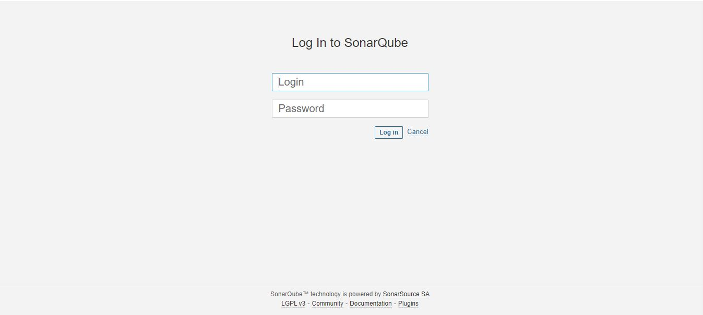  
  
- Lấy Token của user **admin** (mục đích cấp quyền cho Jenkins) bằng cách vào Tab **Administration** => **Security** => **User**  và tạo 1 Access Token mới. Lưu lại token này để dùng cho phần sau

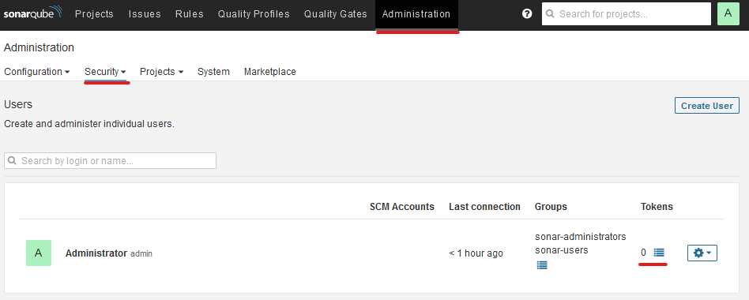

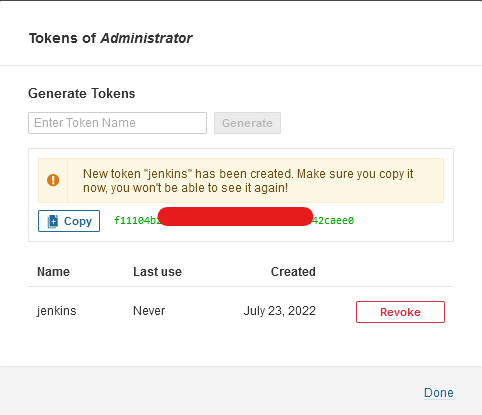

#### 1.2.2. Cấu hình Credentials trên Jenkins  

- Chọn mục **Manage Jenkins** => **Manage Credentials** => Chọn **(global)** => **Add Credentials** => Chọn Kind **Secret text**. Sau đó điền **Secret** là Token được lưu ở bước **1.2.1**. Điền ID và Description và click **OK**

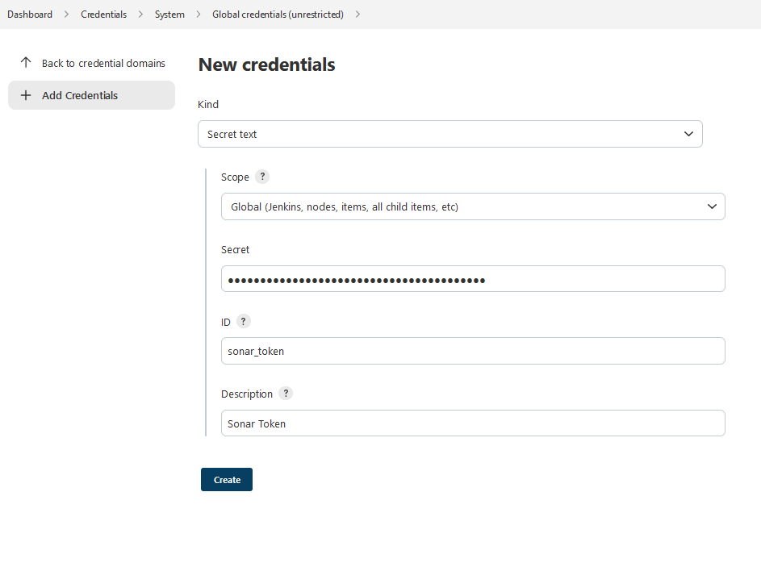

#### 1.2.3. Cài đặt SonarQube scanner, docker, docker pipeline plugin trên Jenkins

- Chọn mục **Manage Jenkins** => **Manage Plugins** => Chọn Tab **Available** => Tìm Plugin **Sonarqube Scanner** 
- => Sau đó nhấn cài đặt (**Install Without Restart**)
- Tương tự cài đặt **docker**, **docker pipeline** plugin

> **Sonarqube Scanner** plugin cho phép quản lý các Agent Sonar dùng để quét code của SonarQube.
> **Docker** và **Docker Pipeline** plugin để cho phép tạo một Jenkins Slave Container theo một Image định nghĩa sẵn và cho phép Job Build của Jenkins chạy trên Slave này

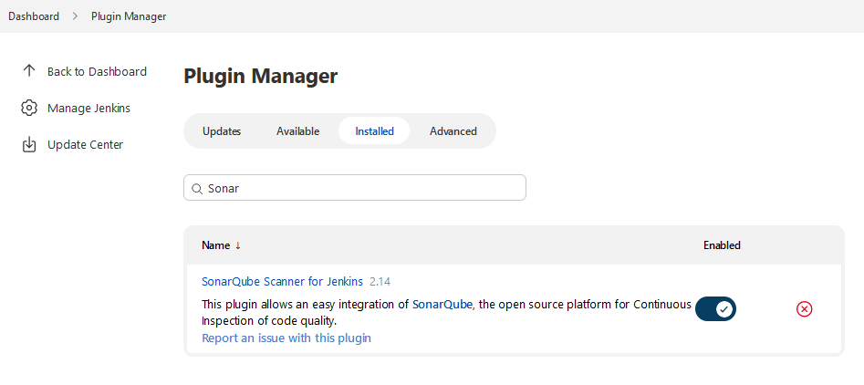

- Sau khi cài đặt Plugin thành công thì cài đặt **SonarQube Scanner**
- Vào  **Manage Jenkins** => **Global Tool Configuration**  tìm tới phần **SonarQube Scanner** => Add **SonarQube Scanner** chọn version mới nhất và cài đặt.

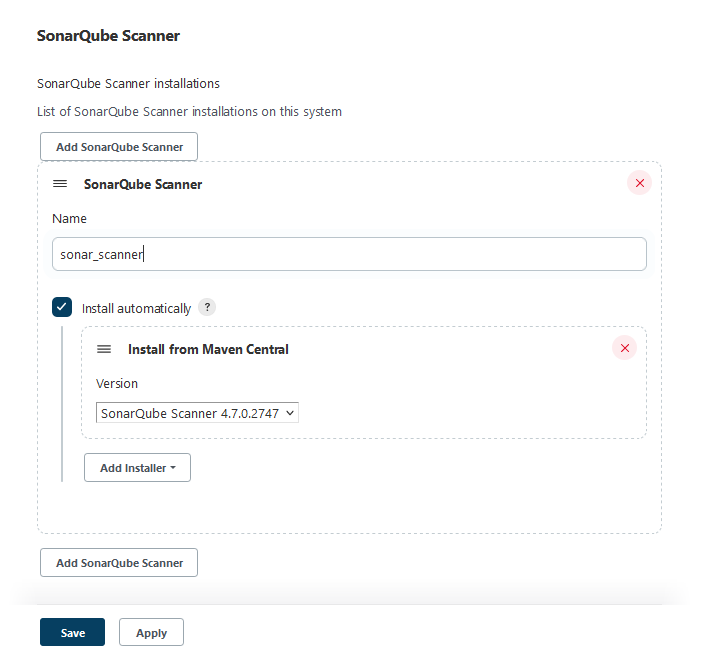

#### 1.2.4. Cấu hình SonarQube server trên Jenkins

- Vào **Manage Jenkins**  => **Configure System** => **SonarQube servers** => **Add SonarQube** => Phần `Name` để là **sonar** (sẽ được dùng trong Jenkinsfile) và phần `Server URL` để đường dẫn tới SonarQube server.
- Tích chọn vào ô **Environment variables**
- Phần Token chọn Token được tạo ra ở bước **1.2.2** rồi click **Save**

> Việc tích chọn vào **Environment variables** sẽ cho phép lấy được các tham số cấu hình của SonarQube trong quá trình chạy Job.

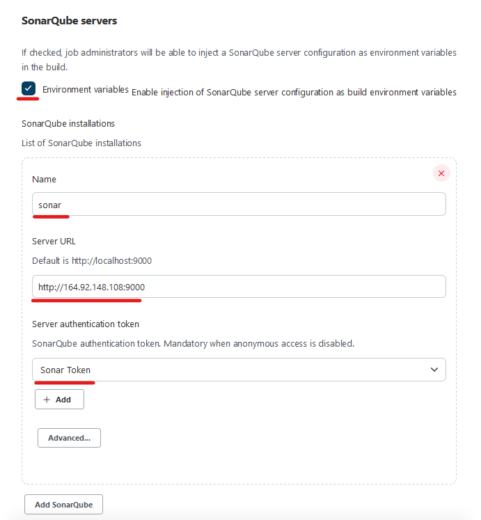

#### 1.2.5. Tạo Webhook trên SonarQube
- Login SonarQube với user mặc định là admin/admin
- Webhook mục đích cho phép SonarQube có thể gửi kết quả phân tích ngược về Jenkins sau khi hoàn thành quá trình quét code
- Trên **SonarQube server** vào **Administration** sau đó chon **Configuration** => **Webhooks** 

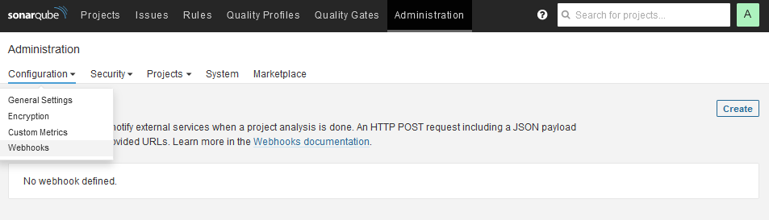

- Create Webhook mới. Phần `Name` điền `jenkins` và phần URL điền đường dẫn của Webhook trên Jenkins là `http://Jenkins_IP:8080/sonarqube-webhook/` 

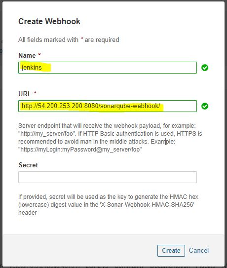

## 2. Quét project sử dụng SonarQube

- Trong phần này, bạn sẽ quét Code của một Project Java mẫu sử dụng SonarQube.
### 2.1. Tạo pipeline
- Chọn **New Item** => Chọn **Pipeline** => Click **OK**
- Mục **Pipeline** => Chọn **Pipeline script from SCM** => Chọn **Git**.
- Phần **Repository URL** chọn tới Repository chứa Jenkinsfile.

> Repository chứa Jenkinsfile là repo được fork về từ repo **jenkins-course** trong phần **jenkins-installation**

 
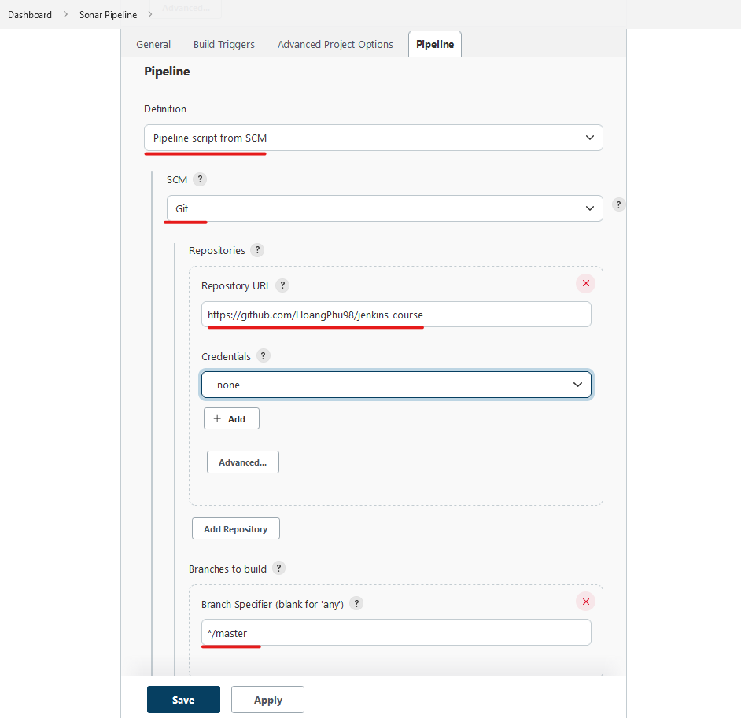

- Phần **Script Path** để đường dẫn tương đối tới **Jenkinsfile** của phần **jenkins-integration**

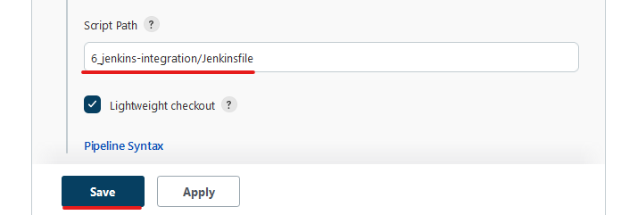

- Click **SAVE**

### 2.2.  Run pipeline

- Click **Build Now**

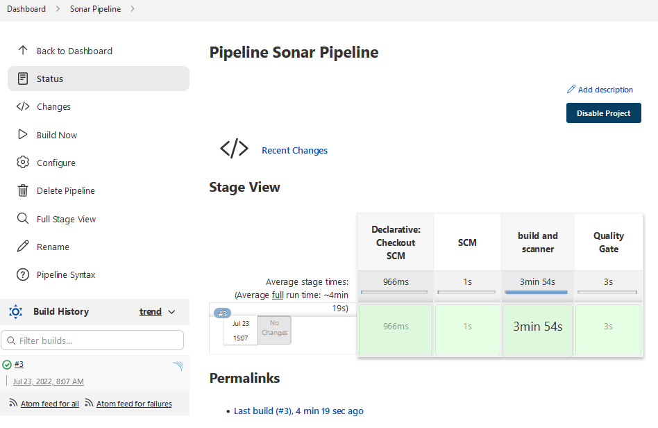

> Challenge: Lần đầu tiên build sẽ bị lỗi, học viên tìm lỗi và tìm cách fix :D

### 2.3. Kiểm tra kết quả quét Code trên SonarQube
- Kết quả quét Code trên SonarQube

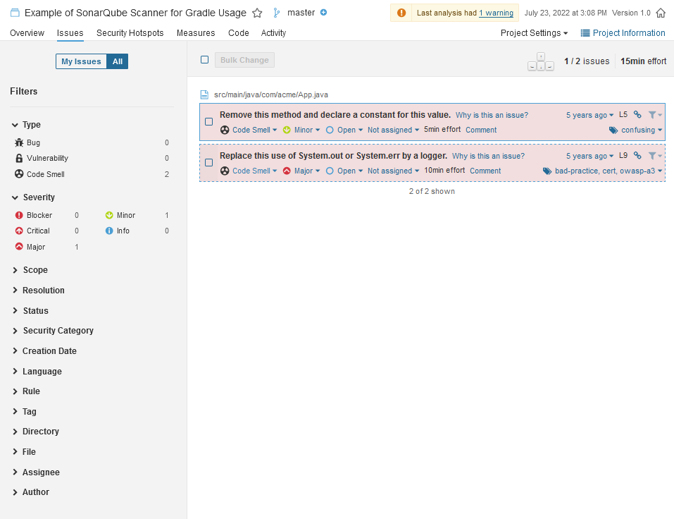

- Ở đây **Quality Gate** là nơi kiểm soát số lỗi quét được của SonarQube và quyết định có cho phép quyết định việc quét code **Pass** hay là **Failed** => Webhook sẽ gửi kết quả này về Jenkins Pipeline và Job Build sẽ **Success hoặc Failed** tương ứng với kết quả của **Quality Gate**

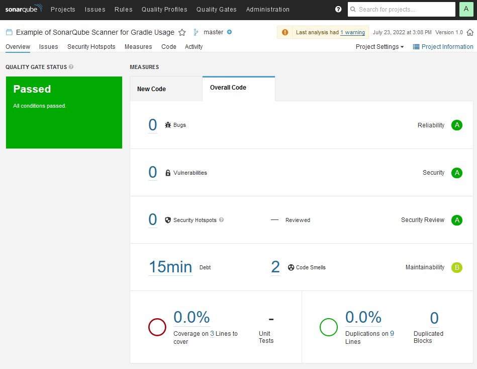

