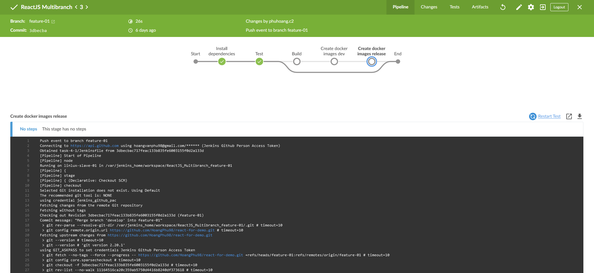

## 1. Cài đặt Plugin

### 1.1.  Cài đặt Blue Ocean plugin on Jenkins  
- Chọn mục **Manage Jenkins** => **Manage Plugins** => Chọn Tab **Available** => Tìm Plugin **Blue Ocean** => Sau đó nhấn cài đặt (**Install Without Restart**)  

- Sau khi cài đặt thành công, trên menu chính sẽ xuất hiện một item Blue Ocean

- Ấn vào biểu tượng để tới UI Blue Ocean, hiển thị danh sách pipeline:

### 1.2. Sử dụng giao diện của Blue Ocean để theo dõi Pipeline

- Chọn một Pipeline có trong danh sách, màn hình chuyển tới danh sách các **Job History**

- Ấn vào một job để xem chi tiết **Job History**

- Pipeline hiển thị trên Blue Ocean giúp dễ dàng cho việc phát hiện lỗi trong một Pipeline phức tạp.

### 1.3. Chạy Job và theo dõi trạng thái trên Blue Ocean

- Sử dụng một Job **Job History** bất kỳ và chạy lại nó để theo dõi trạng thái của Job qua giao diện Blue Ocean. Ví dụ trong `ReactJS Pipeline`, chọn **Job History** và ấn nút hình icon replay để chạy lại Job.

- Theo dõi trạng thái của Job trên Blue Ocean

### Completed Blue Ocean task